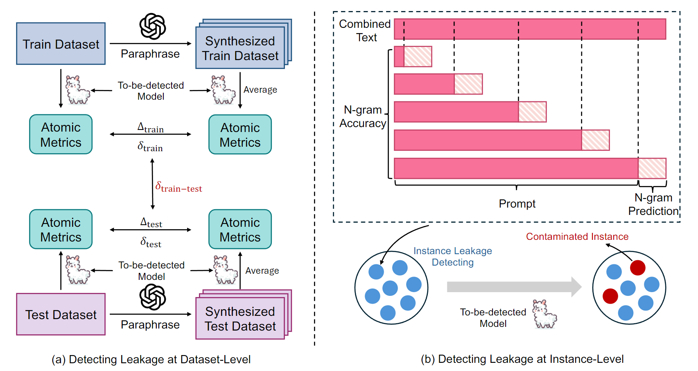
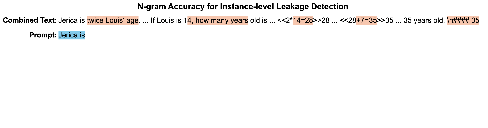
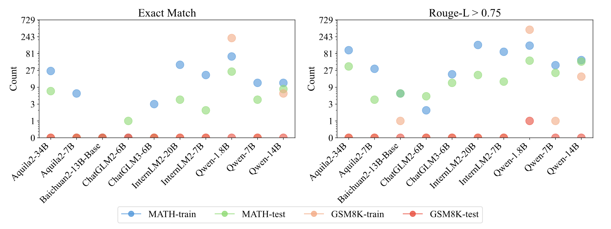
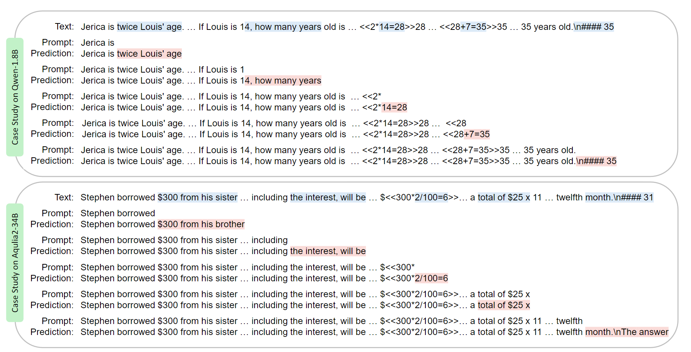

# Benchmarking Benchmark Leakage in Large Langauge Models

This is the official repository for [Benchmarking Benchmark Leakage in Large Langauge Models]()

[Ruijie Xu*](https://plms.ai/people/index.html), [Zengzhi Wang*](https://tinyurl.com/zengzhi-homepage), [Run-Ze Fan*](https://RZFan525.github.io), [Pengfei Liu](https://plms.ai/people/index.html)

[**Homepage**](https://gair-nlp.github.io/benbench/) |
[**HF Demo**](https://huggingface.co/spaces/GAIR/BenBench) | 
[**Datasets**](https://huggingface.co/datasets/GAIR/) | 
[**Paper**](https://huggingface.co/papers/) | 
[**Citation**](https://github.com/GAIR-NLP/benbench?tab=readme-ov-file#citation)


## Table of contents

- [Introduction](#introduction)
- [Detection Pipeline](#detection-pipeline)
- [Leaderboard](#leaderboard)
- [N-gram Accuracy Helps Instance-level Leakage Detection](#instance-level)
- [Case Study](#case-study)
- [How to evaluate a model using our pipeline](#pipeline)
- [Citation](#citation)

## 🚀Introduction

Amid the expanding use of pre-training data, the phenomenon of benchmark dataset leakage has become increasingly prominent, exacerbated by opaque training processes and the often undisclosed inclusion of supervised data in contemporary Large Language Models (LLMs). This issue skews benchmark effectiveness and fosters potentially unfair comparisons, impeding the field's healthy development.  Given that training data and model details are often opaque, and the leakage detection is influenced by various factors such as mode size and training strategies, detecting benchmark leakage is not a trivial task. In this work, we are not pursuing technical contributions in system development; instead, we are attempting to encourage the healthy development of this field, particularly through the lens of *mathematical reasoning* tasks, in the following aspects: (1) Summaries of various pre-training behaviors and challenges for detecting benchmark leakage; (2) Proposal of a detection pipeline for estimating pre-training behaviors; (3) Leakage analysis of existing models; (4) Recommendation for model documentation (i.e., introducing Benchmark Transparency Card), benchmark setup and future evaluations. 


Refer to our paper for more details.


## Detection Pipeline

We introduce a simple, computationally efficient, and scalable pipeline that leverages two fundamental yet insightful atomic metrics: *Perplexity* and *N-gram Accuracy*. These metrics effectively encapsulate the essence of language modeling, capturing its nuances from continuous and discrete perspectives, respectively. By paraphrasing benchmarks to create varied reference versions, we can detect discrepancies in models' atomic metrics, thereby identifying potential data leakage. This pipeline's validity is supported by thorough meta-experiments.


<figure >

<figcaption>
<center><p>Overview of detection pipeline</p></center>
</figcaption>            
</figure>


## 🏆Leaderboard

We extend our investigation to analyze existing models (i.e., 31 open-source LLMs), revealing that, in addition to previously identified leaks, many (i.e., approximately half of them), including well-known language models, may have inadvertently leveraged training data to boost their performance on mathematical reasoning tasks, leading to unfair advantages.


<figure >
  
  <figcaption>
    <center><p>The relative possibility that various models conduct verbatim training on the training set of a benchmark over test set to enhance capabilities (measured based on PPL and N-gram Accuracy). Models exhibiting near-zero possibilities suggest either the absence of training and test split or the use of both splits in the training process.</p></center>
  </figcaption>           
</figure>


## 📊 N-gram Accuracy Helps Instance-level Leakage Detection
<span id="instance-level"></span>




High prediction accuracy for each n-gram of an example's prediction suggests a high probability that the sample was encountered during the training process. To investigate instance-level leakage, we looked closer at n-gram predictions across different models. Additionally, considering that benchmark data may undergo reformatting, paraphrasing, or other modifications when integrated into model training, we leverage lenient metrics, such as ROUGE-L and edit distance similarity, for comparing n-grams. Under this context, an instance is deemed correctly predicted if it achieves an Exact Match (meaning all predictions align perfectly), or if the edit distance similarity of all predictions exceeds 0.9 (indicating substantial similarity), and further, if the ROUGE-L score of all predictions surpasses 0.75.


<figure >
  
  <figcaption>
    <p>Statistics of suspicious leaked sample, where all 5-grams within a sample are predicted correctly, either strictly (measured by Exact Match) or loosely (measured by ROUGE-L). The y-axis employs an exponential scale based on powers of 3.</p>
  </figcaption>           
</figure>


We can observe that many models can all ngrams of an example from benchmark training set even test set. 


## 📚Case Study

<figure >
  
  <figcaption>
    <p>Two cases: one from the GSM8K training set predicted by the Qwen-1.8B model (above), and one from the GSM8K test set by the Aquila2-34B model (below). Both examples are presented with the original question and answer concatenated, separated by a space.</p>
  </figcaption>           
</figure>


In the first case, the Qwen-1.8B model achieves perfect n-gram predictions on a sample from the GSM8K training set, completing all 5-grams accurately. This strongly suggests potential data leakage within the training set of GSM8K. Additionally, we also conducted a case study on the Aquila2-34B model, known to accidentally be exposed to the entire GSM8K test set. It consistently predicts n-grams as  "The answer is" for all instances where the ground truth was represented by a placeholder "####". This observation exactly explains why it is challenging to detect  leakage using our n-gram accuracy metric. To enhance readers' comprehension of model behaviors, we have released an interactive demo for case studies, available at <a href="https://huggingface.co/spaces/GAIR/BenBench">Huggingface Space: BenBench</a>.


## 🌴How to evaluate a model using our pipeline
<span id="pipeline"></span>

Install dependencies

```
pip install -r requirements.txt
```


Run the pipeline (please specify the ckpt path before running the pipeline)

```
cd src
bash ppl.sh
bash ngram_acc.sh
```


## 🥳Citation

If you find our work useful, please cite our paper:

```


```